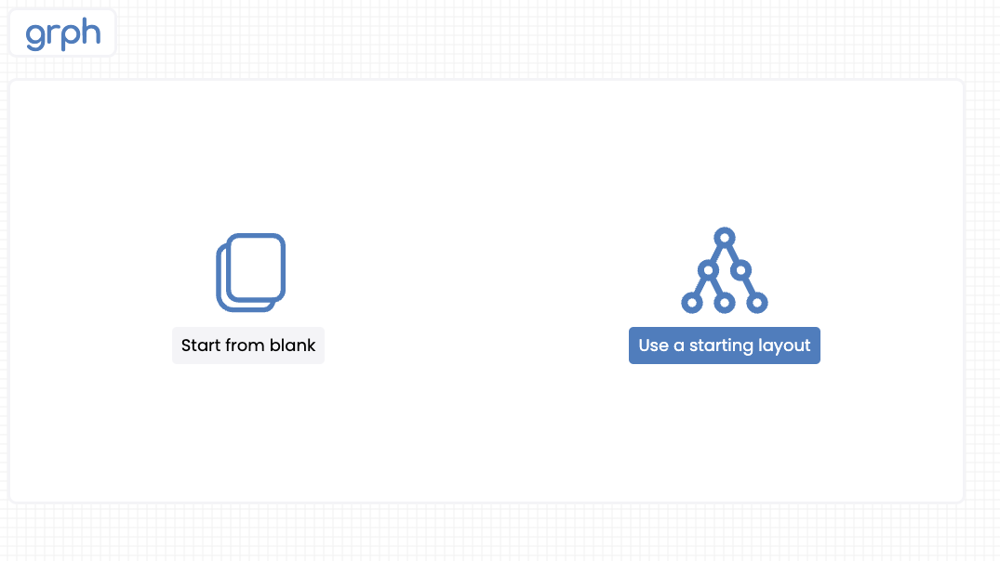
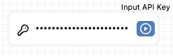
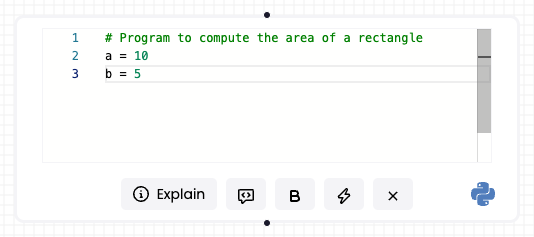
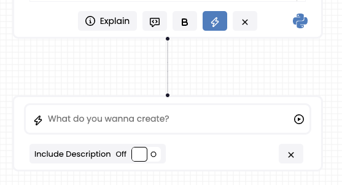
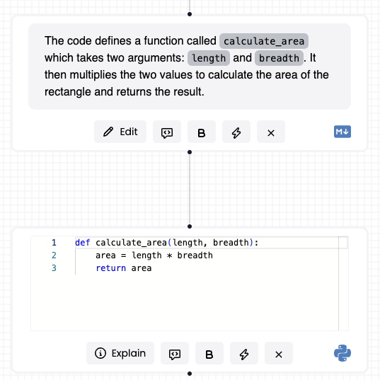

# Overview

GprhBook is an interactive python notebook client that allows to visualize notebooks as a 2D workflow.

## Quick Start

Head over to the [sandbox environment](https://grphbook.vercel.app/) to try out GrphBook.

## Start from Sample Layout



Select `Use a starting layout` to get started.

## ChatGPT API Key



Should you need to use the AI generation features, enter the GPT API key.

## Edit the coding cell



Create your sample program

## Generate code for a routine



Using the generation node, enter the prompt for the routine.

## Arrange your generated nodes



# How to contribute

## Installation

```bash
npm install grphbook
```

## Development Build

### Add the API token

If you wish to use the AI features without entering the API key through the user interface, then add the token to the `.env` file.

```bash
echo "REACT_APP_OPENAI_API_KEY=${API_TOKEN}"
```

### Start the development build

```bash
npm start
```

Thank you for your interest in contributing to Grphbook! We welcome contributions from the community to help make this project even better. Whether you want to report a bug, suggest a new feature, or contribute code, your help is greatly appreciated.

### Reporting Issues

If you come across a bug or have a feature request, please open an issue on the GitHub issue tracker. When reporting issues, be sure to provide detailed information about the problem, including steps to reproduce it.

### Feature Requests

If you have an idea for a new feature, we'd love to hear about it! Please open an issue on the GitHub issue tracker and use the "Feature Request" label.

### Contributing Code

Fork and Clone the Repository
Fork the Grphbook repository on GitHub.
Clone your fork to your local machine.

```bash
# Copy code
git clone https://github.com/your-username/grphbook.git
```

### Install Dependencies

Make sure you have Node.js and npm installed on your machine. Install project dependencies using:

```bash
# Copy code
npm install
```
